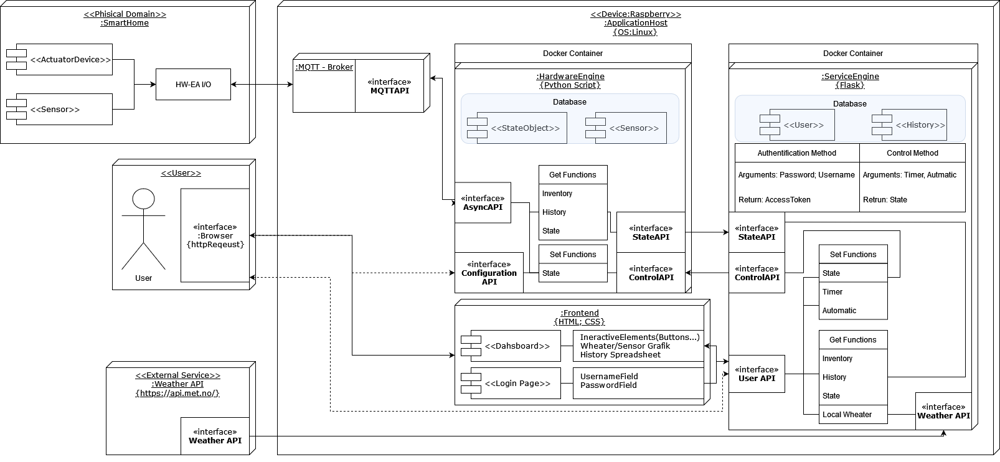
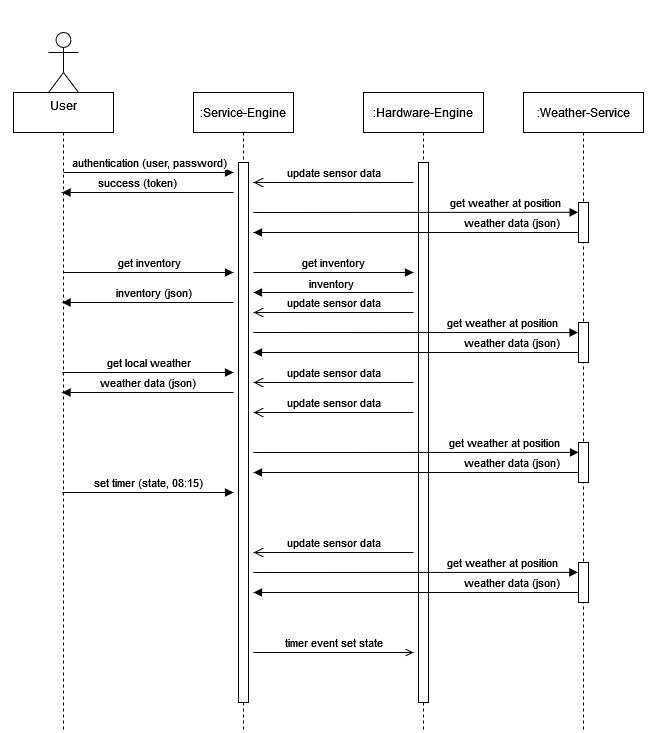

# Scoping and Structuring
## Abstract
The topic of smart home technology gained importance over the last decade, introducing the concept of networking devices and equipment in domestic areas. Increasing demand for renewable energy and efficient usage creates a need for intelligent smart-home systems to contribute to the goals of EUs *Energy Efficiency Directive* as well as creating a sustainable, reliable, scalable application framework. 

On the one hand this framework integrates hardware peripherals accessed by an MQTT broker running on a Raspberry Pi. On the other hand a hardware and service engine provides logic and a database for the application. Control and state APIs are defined for standardized communication between hard- and software engines, wherein an asyncAPI is defined for data exchange between MQTT-Server and hardware engine (see Figure \ref{fig:concept} for more details). A user can access the smart home system by entering the right credentials on a website. The web server is created with the flask python library. 

A graphical dashboards provides the user with weather information requested from MET Norway Weather API v.3, status of sensors and relais and allows to set the status of actuators and define  simple timer switching logic in an interactive way. Alternatively a user may also access the hardware engine directly via its exposed API. Overall this smart service is meant to be a contribution to solve the environmental and energy management challenges of the 21’st century.

# Services and their Interfaces:

## UML Component and Sequence Diagram
Figure \ref{fig:component} shows the main components of the project, Figure \ref{fig:sequence} illustrates a typical user interaction in form of a sequence diagram.

## Physical Domain
**Description:** The Physical Domain is the service containing all the
entities to be controlled and whose state is to be sensed, including the I/O modules, thus provide the interface between the actual hardware to sense/control and the software.

**AsyncAPI (MQTT):** \texttt{./physical\_domain\_async.yaml}

## Hardware Engine
**Description:**  Transforms the state data of the physical Domain to
data usable for the Service Engine and transforms
control data of the Service Engine to data interpretable
by the physical domain.

**AsyncAPI (MQTT):** \texttt{./hardware\_engine\_async.yaml}

**State, Control \& Configuration API (REST):** \texttt{./physical\_domain\_rest.yaml}

## Service Engine
**Description:** Transforms state data of the Hardware Engine to
visualisable data for the user frontend, transforms user
commands to commands for the hardware engine,
transforms data from external services to a usable format

### External Services
**Description:** Local weather data - Get the actual weather data from the area in which the smart home service is installed. (Also displayed in the dashboard)

**Wheather API (REST):** \texttt{https://api.met.no/}

### Web dashboard as Graphical User Interface
**Description:** Interactive elements and history in spreadsheet format is provided in a dashboard for the user as a visual interface for the user api.

**User API (REST):** \texttt{./User-API.yaml}
